.. _era:

---
Era
---

*The estimated time to complete this lab is 60 minutes.*

.. raw:: html

  <iframe width="640" height="360" src="https://www.youtube.com/embed/AbPMhTQ40Mw?rel=0&amp;showinfo=0" frameborder="0" allow="accelerometer; autoplay; encrypted-media; gyroscope; picture-in-picture" allowfullscreen></iframe>

概览
++++++++

Nutanix Era是一个软件套件，可自动执行并简化数据库管理-为数据库配置和生命周期管理（LCM）带来一键式简单性和不可见的操作。

Nutanix Era以一键式数据库配置和复制数据管理（CDM）作为其第一项服务，使DBA可以在任何时间点配置，克隆，刷新和备份其数据库。 每个垂直领域的业务应用程序都依赖于数据库，从而在生产和非生产环境中提供用例。

**在本实验中，您将探索如何使用Era来标准化数据库部署，如何从生产数据库快速克隆到用于应用程序开发的克隆，基于生产数据更新该克隆。**

实验准备
+++++++++

This lab requires applications provisioned as part of the :ref:`windows_tools_vm`.

If you have not yet deployed this VM, see the linked steps before proceeding with the lab.

Deploying Era
+++++++++++++

Era是一个虚拟机appliance，可以安装在AHV或ESXi上。在这个实验室中，您将把Era部署到AHV集群中。

在 **Prism Central**, 选择 :fa:`bars` **> Virtual Infrastructure > VMs**.

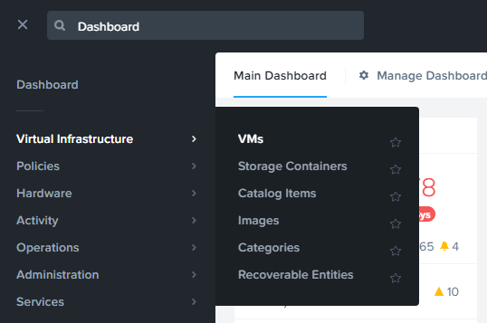

点击 **Create VM**.

填写如下参数:

- **Name** - *Initials*-Era
- **Description** - (可选) 该vm的描述
- **vCPU(s)** - 4
- **Number of Cores per vCPU** - 1
- **Memory** - 16 GiB

- 选择 **+ Add New Disk**
    - **Type** - DISK
    - **Operation** - 选择从Image Service克隆
    - **Image** - Era\*.qcow2
    - 选择 **Add**

- 选择 **Add New NIC**
    - **VLAN Name** - Primary
    - 选择 **Add**

点击 **Save** 创建VM.

选择Era VM 并点击 **Power On**.

注册集群
+++++++++++++++++++++

在 **Prism Central > VMs > List**, 识别并确定刚才创建的ERA虚拟机的ip地址，使用 **IP Addresses** 列。

在浏览器中打开 \https://*ERA-VM-IP:8443*/ 。

.. 注意::

启动VM后，Era可能需要2分钟来初始化。

选择 **I have read and agree to terms and conditions** 并点击 **Continue**.

输入 **techX2019!** 作为 **admin** 的密码并点击**Set Password**.

通过如下用户名和密码登陆:

- **Username** - admin
- **Password** - techX2019!

在 **Welcome to Era** 页面, 填写以下信息:

- **Name** - *Your Cluster Name*
- **Description** - (Optional) Description
- **Address** - *Your Prism Element Cluster IP*
- **Prism Element Administrator** - admin
- **Password** - techX2019!

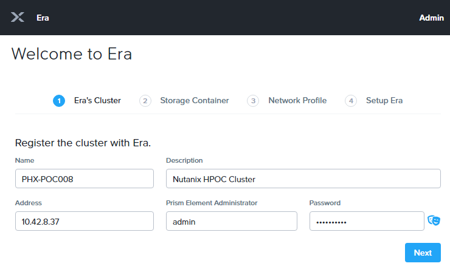

.. note::

  Era requires a Prism Element account with full administrator access. For ESXi clusters, vCenter must also be registered with Prism Element.

点击 **Next**.

选择 **Default** storage container 并点击 **Next**.

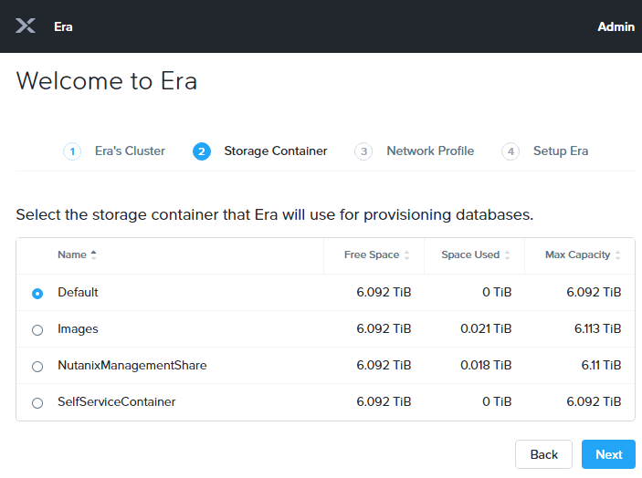

选择 **Primary** VLAN. 这是Era在部署新数据库时将使用的默认网络配置文件。**不要**选择**Manage IP Address Pool**, 因为您的AHV集群已经为该网络配置了DHCP。

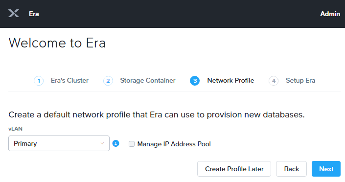

点击 **Next**.

当Era 部署成功后，点击**Get Started**.

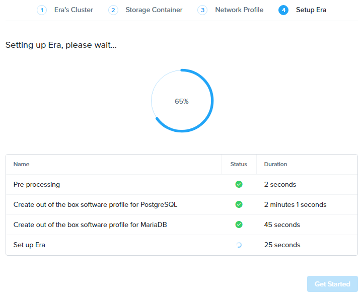

制备数据库
+++++++++++++++++++++++

Era的最初版本支持以下操作系统和数据库服务器::

- CentOS 6.9, 7.2, and 7.3
- Oracle Linux 7.3
- RHEL 6.9, 7.2, and 7.3
- Windows Server 2012, Windows Server 2012 R2, and Windows Server 2016
- Oracle 11.2.0.4.x, 12.1.0.2.x, and 12.2.0.1.x
- PostgreSQL 9.x and 10.x
- SQL Server 2008 R2, SQL Server 2012, SQL Server 2014, and SQL Server 2016

Era可用于在已注册的Nutanix集群上提供数据库服务器和数据库，也可以注册在该集群上运行的现有源数据库。在这个实验室中，将自动部署一个新的PostgreSQL数据库服务器和数据库。
通过提供软件、计算和数据库参数的示例配置文件，Era使提供简单的PostgreSQL数据库部署方式。您将研究每个配置文件，以了解它们是如何配置的。

选择 **Era > Getting Started** 并点击 **Profiles**.

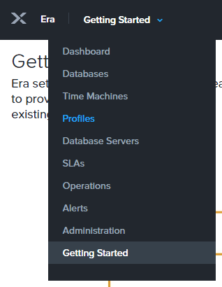

选择 **Software** 并注意到在Era配置文件中已经包含了 **PostgreSQL 10.4** 和 **MariaDB 10.3**。 在PostgreSQL以外, MariaDB, SQL Server, 和Oracle profiles 可以通过注册原有数据库到Era的方式进行创建。

选择 **Compute > DEFAULT_OOB_COMPUTE** 并注意到默认的 Compute Profile 可为VM创建4 个core, 32GiB 内存，用于支撑数据库。为了减少共享实验室环境中的内存消耗，您也可以创建一个自定义的计算配置文件，例如下面步骤。

点击 **+ Create** 并输入以下参数:

- **Name** - Lab（可自行命名）
- **Description** - Lab Compute Profile （可自行定义描述内容）
- **vCPUs** - 1 （可定义vCPU数量，比如这里是1）
- **Cores per CPU** - 2 （虚拟CPU的核数）
- **Memory (GiB)** - 16 （内存）

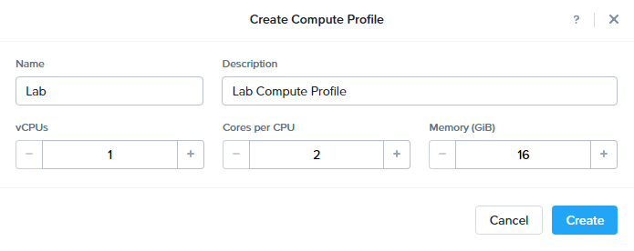

点击 **Create**.

选择 **Database Parameters > DEFAULT_POSTGRES_PARAMS**可看到由Era提供的PostgreSQL数据库的默认参数（保留原参数，无需修改）。

选择**Era > Profiles** 并点击 **Getting Started**.

在 **Getting Started** 页面, 点击**Provision a Database**下面的 **PostgreSQL**。

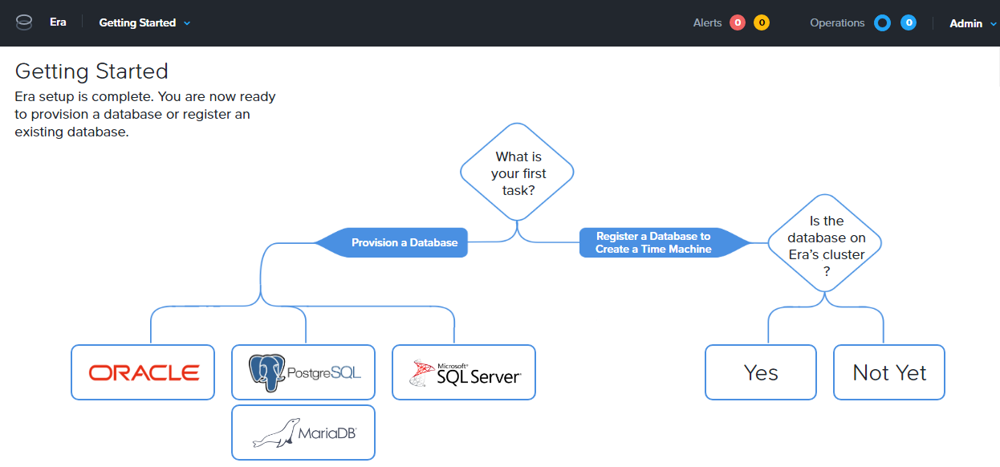

点击**Provision a Database**.

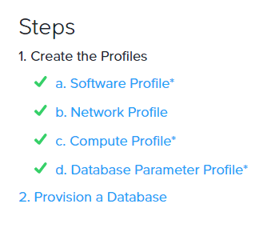

选择 **PostgreSQL** engine并点击 **Next**.

输入以下**Database Server** 参数:

- **Database Server** - 选择**Create New Server**
- **Database Server Name** - *Initials*-DBServer
- **Compute Profile** - Lab（默认的或刚才自定义创建的Compute profile）
- **Network Profile** - DEFAULT_OOB_NETWORK
- **Software Profile** - POSTGRES_10.4_OOB
- **Description** - (Optional) Description
- **SSH Public Key for Node Access** - （可使用以下秘钥）

.. code-block:: text

  ssh-rsa AAAAB3NzaC1yc2EAAAADAQABAAABAQCoQRdEfm8ZJNGlYLQ2iw08eVk/Wyj0zl3M5KyqKmBTpUaS1uxj0K05HMHaUNP+AeJ63Qa2hI1RJHBJOnV7Dx28/yN7ymQpvO1jWejv/AT/yasC9ayiIT1rCrpHvEDXH9ee0NZ3Dtv91R+8kDEQaUfJLYa5X97+jPMVFC7fWK5PqZRzx+N0bh1izSf8PW0snk3t13DYovHFtlTpzVaYRec/XfgHF9j0032vQDK3svfQqCVzT02NXeEyksLbRfGJwl3UsA1ujQdPgalil0RyyWzCMIabVofz+Czq4zFDFjX+ZPQKZr94/h/6RMBRyWFY5CsUVvw8f+Rq6kW+VTYMvvkv

.. 注意::

  以上SSH公钥作为示例提供，并被配置为Era提供的操作系统的授权密钥。在非实验室设置中，您将创建自己的SSH私有/公共密钥对，并在此步骤中提供公共密钥。

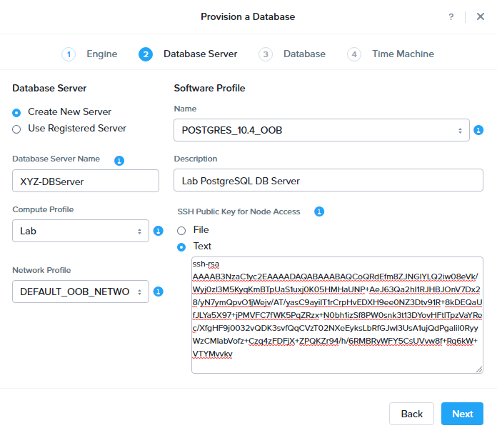

点击 **Next**.

输入以下 **Database** 字段:

- **Database Name** - *Initials*\_LabDB
- **Description** - (Optional) Description
- **POSTGRES Password** - techX2019!
- **Database Parameter Profile** - DEFAULT_POSTGRES_PARAMS
- **Listener Port** - 5432
- **Size (GiB)** - 200

.. note::

  Era还提供了在数据库创建之前和之后运行脚本或命令的能力。这些可用于根据特定的企业需求进一步定制环境。

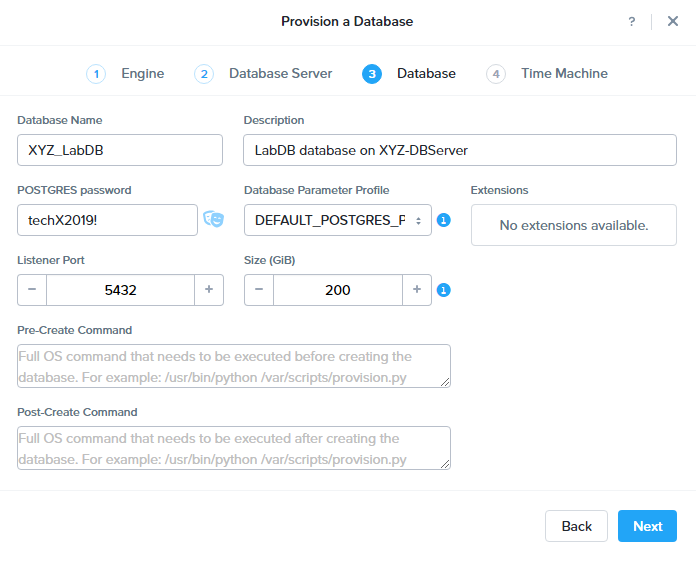

点击 **Next**.

输入以下 **Time Machine** 字段:

- **Name** - *Initials*\_LabDB_TM
- **Description** - (Optional) Description
- **SLA** - Gold
- **Schedule** - Default

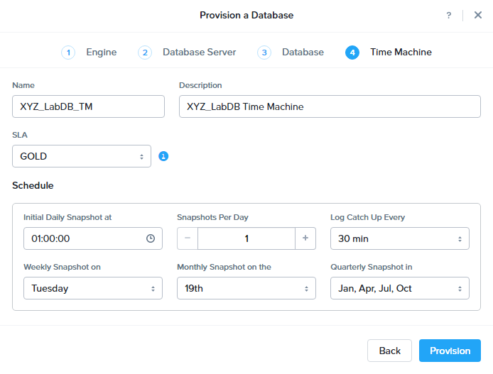

点击 **Provision**.

点击 **Operations** 在右上角查看配置进度。准备大约需要5分钟。

.. note::

 Era中的所有操作都有唯一的id，对于日志记录/审计都是完全可见的。

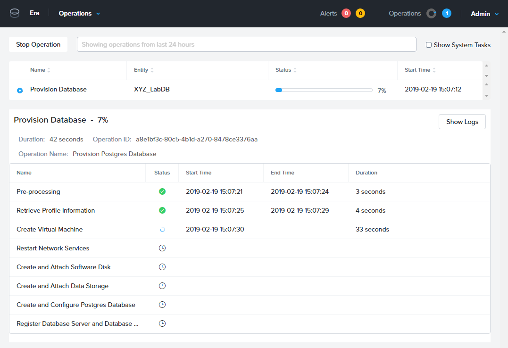

完成后, 选择 **Dashboard** 菜单并注意到在 **Source Database**中已经有了一个新的数据库。

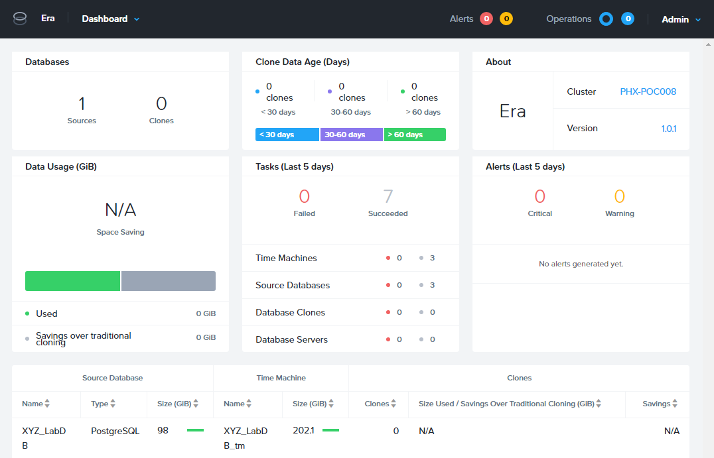

您还应该能够在prism中看到所运行的 *Initials*-**DBServer**。

连接并管理Database
++++++++++++++++++++++++++

现在Era已经成功地提供了一个数据库实例，您可连接到该实例并验证是否创建了数据库。

从下拉菜单选择 **Era > Databases**。

在**Sources**中，点击您所部署的数据库.

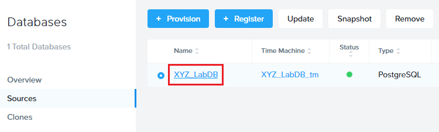

注意查看您创建的 **Database Server** 的IP地址。

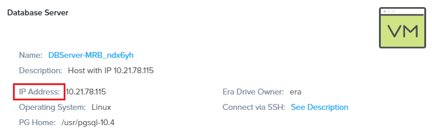

使用 *Initials*\ **-Windows-ToolsVM**, 打开 **pgAdmin**.

.. note::

  If installed, you can also use a local instance of pgAdmin. The Tools VM is provided to ensure a consistent experience.

在 **Browser**下面, 右击 **Servers** 并选择 **Create > Server...** .

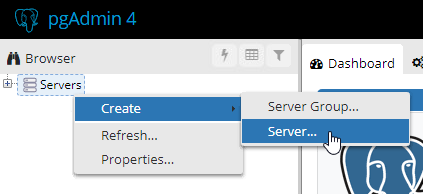

在 **General** 选项, 提供您数据库服务器名称 (e.g. *Initials*-**DBServer**).

在 **Connection** 选项, 输入以下信息:

- **Hostname/IP Address** - *Initials*-DBServer IP Address
- **Port** - 5432
- **Maintenance Database** - postgres
- **Username** - postgres
- **Password** - techX2019!

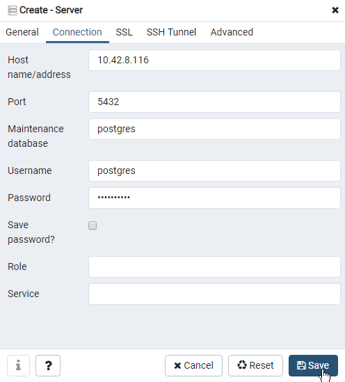

展开 *Initials*\ **-DBServer > Databases** a并注意到Era已经部署了一个空的数据库。

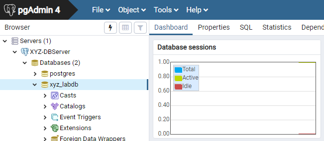

..  Now you will create a table to store data regarding Names and Ages.

  Expand *Initials*\_**labdb** **> Schemas > public**. Right-click on **Tables** and select **Create > Table**.

  .. figure:: images/5e.png

  On the **General** tab, enter **table1** as the **Name**.

  On the **Columns** tab, click **+** and fill out the following fields:

  - **Name** - Id
  - **Data type** - integer
  - **Primary key?** - Yes

  Click **+** and fill out the following fields:

  - **Name** - Name
  - **Data type** - text
  - **Primary key?** - No

  Click **+** and fill out the following fields:

  - **Name** - Age
  - **Data type** - integer
  - **Primary key?** - No

  .. figure:: images/5f.png

  Click **Save**.

  Using your **Tools VM**, open the following link to download a .CSV file containing data for your database table: http://ntnx.tips/EraTableData

  Using **pgAdmin**, right-click **table1** and select **Import/Export**.

  Toggle the **Import/Export** button to **Import** and fill out the following fields:

  - **Filename** - C:\\Users\\Nutanix\\Downloads\\table1data.csv
  - **Format** - csv

  .. figure:: images/5g.png

  Click **OK**.

  You can view the imported data by right-clicking **table1** and selecting **View/Edit Data > All Rows**.

克隆您的 PostgreSQL 资源
+++++++++++++++++++++++

现在您已经创建了一个源数据库，您可以使用Era Time Machine轻松地克隆它。数据库克隆有助于开发和测试目的，允许非生产环境在不影响生产操作的情况下利用生产数据。Era克隆利用了nutanix本地写时复制克隆技术，允许零字节的数据库克隆。这种空间效率可以显著降低支持大量数据库克隆的环境的存储成本。

在 **Era > Time Machines**, 为你的数据库 Time Machine instance for your source database.

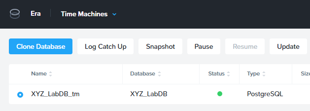

Click **Snapshot** and enter **First** as the **Snapshot Name**.

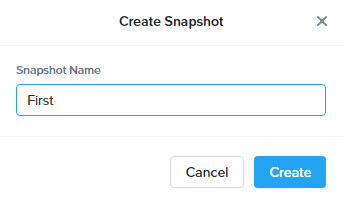

Click **Create**.

You can monitor the **Create Snapshot** job in **Era > Operations**.

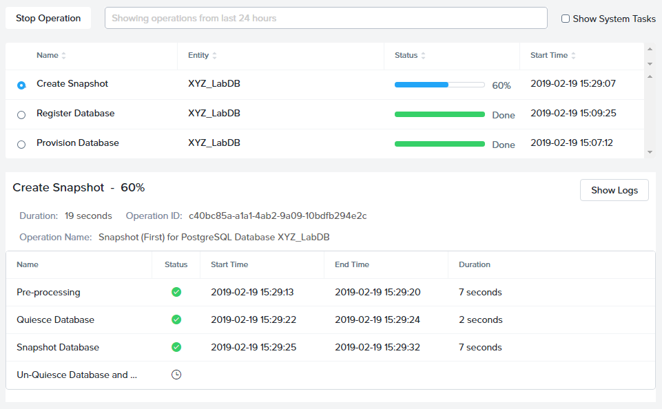

After the snapshot job completes, select the Time Machine instance for your source database in **Era > Time Machines** and click **Clone Database**.

On the **Time** tab, select **Snapshot > First**.

.. note::

  Without creating manual snapshots, Era also offers the ability to clone a database based on **Point in Time** increments including Continuous (Every Second), Daily, Weekly, Monthly, or Quarterly. Availability is controlled by the SLA of the source.

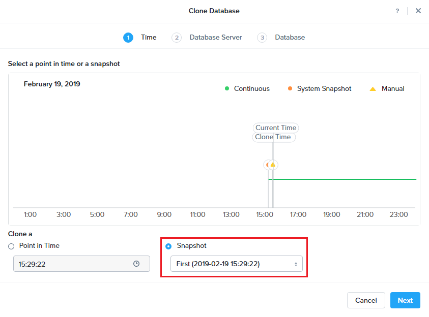

Click **Next**.

On the **Database Server** tab, fill out the following fields:

- **Database Server** - Create New Server
- **VM Name** - *Initials*-DBServer-Clone
- **Compute Profile** - Lab
- **Network Profile** - DEFAULT_OOB_NETWORK
- **SSH Public Key** -

.. code-block:: text

  ssh-rsa AAAAB3NzaC1yc2EAAAADAQABAAABAQCoQRdEfm8ZJNGlYLQ2iw08eVk/Wyj0zl3M5KyqKmBTpUaS1uxj0K05HMHaUNP+AeJ63Qa2hI1RJHBJOnV7Dx28/yN7ymQpvO1jWejv/AT/yasC9ayiIT1rCrpHvEDXH9ee0NZ3Dtv91R+8kDEQaUfJLYa5X97+jPMVFC7fWK5PqZRzx+N0bh1izSf8PW0snk3t13DYovHFtlTpzVaYRec/XfgHF9j0032vQDK3svfQqCVzT02NXeEyksLbRfGJwl3UsA1ujQdPgalil0RyyWzCMIabVofz+Czq4zFDFjX+ZPQKZr94/h/6RMBRyWFY5CsUVvw8f+Rq6kW+VTYMvvkv

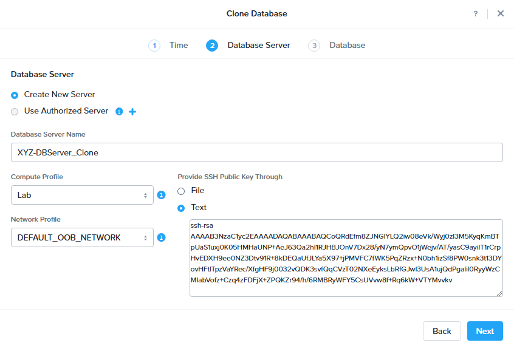

Click **Next**.

On the **Database Server** tab, fill out the following fields:

- **Name** - *Initials*\_LabDB_Clone
- **Description** - (Optional) Description
- **Password** - techX2019!
- **Database Parameter Profile** - DEFAULT_POSTGRES_PARAMS

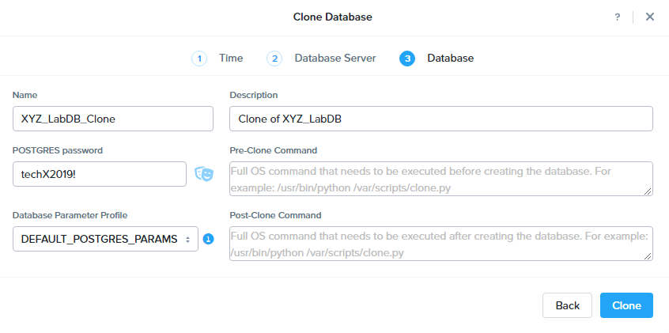

Click **Clone**.

The cloning process will take approximately the same amount of time as provisioning the original database and can be monitored in **Era > Operations**.

While waiting for the clone to complete, explore **Era > SLAs** to understand the differences between standard SLAs offered by Era, or create your own custom SLA.

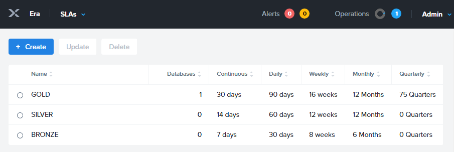

Following the completion of the clone operation, you can connect to the clone instance as described in the previous section, `Connecting to the Database`_.

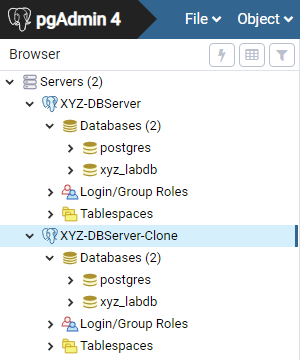

The newly provisioned clone is now ready to be used.

Refreshing A Cloned Database
++++++++++++++++++++++++++++

The ability to easily refresh a cloned database using new data from the source database improves development, test, and other use cases by ensuring they have access to new and relevant data. In this section you will add a new table for storing data to your source database, and refresh the existing clone.

In **pgAdmin**, select your source database (**NOT** the cloned database), and from the menu bar click **Tools > Query Tool**.

Start pgAdmin, select your source database instance, go to the **Tools** menu and select **Query Tool**.

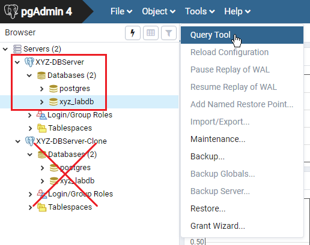

From the **Query Tool**, type the following SQL command into the editor:

.. code-block:: postgresql
  :name: products-table-sql

  CREATE TABLE products (
  product_no integer,
  name text,
  price numeric
  );

Click :fa:`bolt` **Execute/Refresh**.

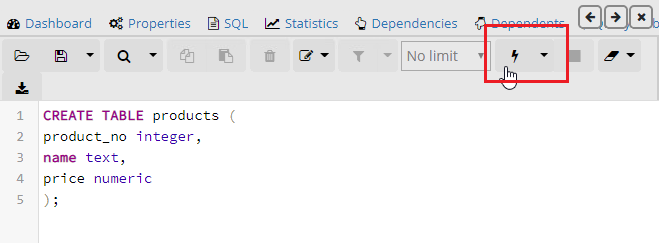

Verify the creation of the table under **Schemas > Public > Tables > products**.

.. note::

  You may need to refresh **Tables** for the newly created table to appear.

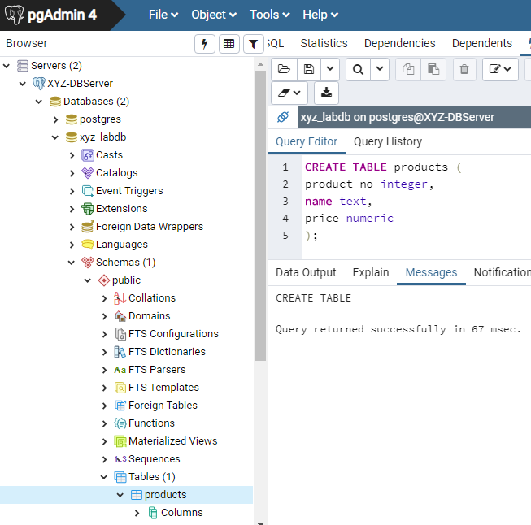

Previously you created a manual snapshot on which to base your cloned database, for the refresh you will leverage the **Point in Time** capability of Era.

The default schedule for **Log Catch Up**, configured when provisioning the source database, is every 30 minutes. Based on this schedule, you should expect to be able to refresh the database based on updates older than 30 minutes with no further action required.

In this case, you just created the **products** table in your source database, so a manual execution of **Log Catch Up** would be required to copy transactional logs to Era from your source database.

In **Era > Time Machines**, select the Time Machine instance for your source database and click **Log Catch Up > Yes**.

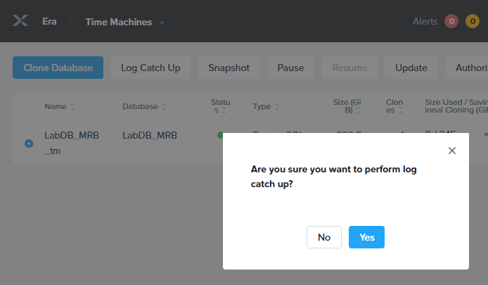

Once the **Log Catchup** job completes, in **Era > Databases > Clones**, select the clone of your source database and click **Refresh**.

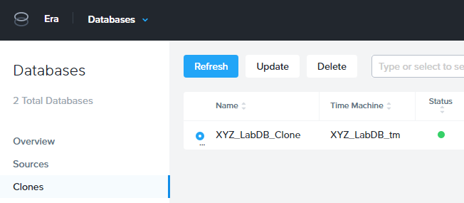

Refreshing to the latest available **Point in Time** is selected by default. Click **Refresh**.

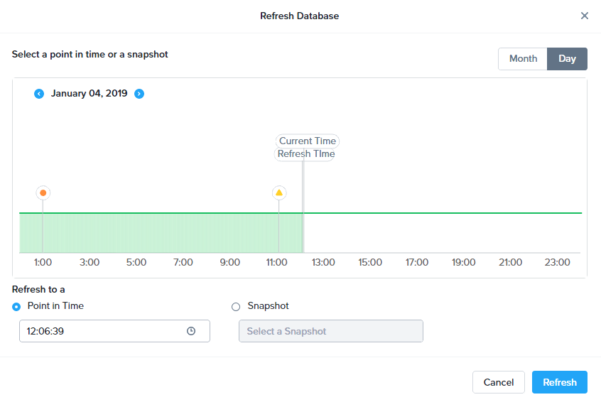

Observe the steps taken by Era to refresh the cloned database in **Operations**.

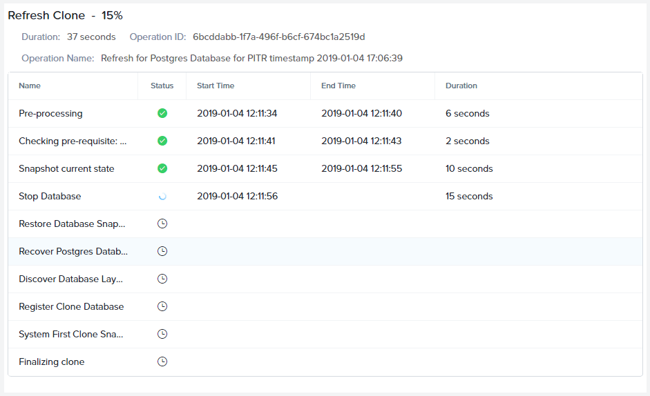

Once the **Refresh Clone** job is complete, refresh the **Tables** view of your clone database in **pgAdmin** and confirm the **products** table is now present.

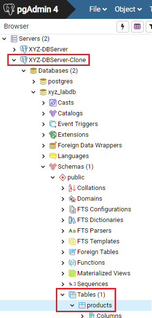

In just a couple of clicks and minutes you were able to update your cloned database using the latest available production data. This same approach could be leveraged to recover absent data from a database by provisioning a clone based on a previous snapshot or point in time.

Return to the **Dashboard** and review the critical information Era provides to administrators, including storage savings, clone aging, tasks, and alerts.

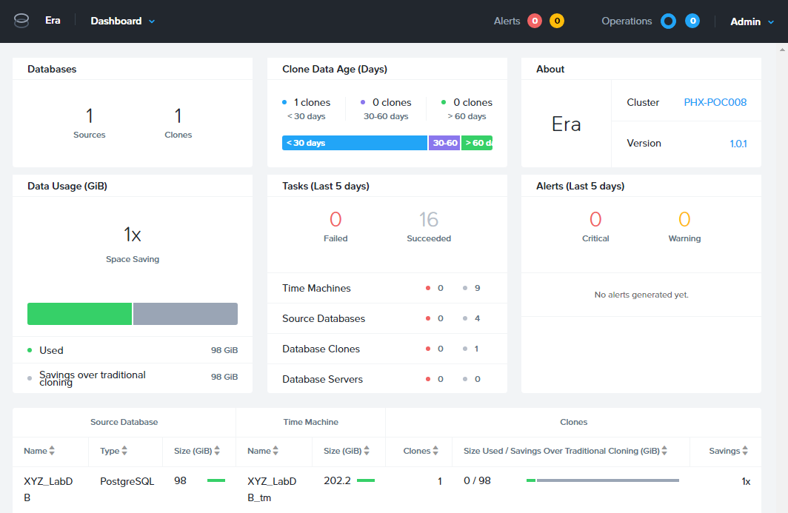

Using the Era REST API Explorer
+++++++++++++++++++++++++++++++

Era features an "API first" architecture and provides a fully documented REST API to allow for automation and orchestration of its functions through external tools. Similar to Prism, Era also provides a Rest API Explorer to easily discover and test API functions.

From the menu bar, select **Admin > REST API Explorer** from the top right.

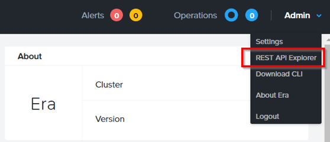

Expand the different categories to view the available operations, including registering Nutanix clusters, registering and provisioning databases, cloning and refreshing databases, updating profiles and SLAs, and getting operation and alert information.

As a simple test, expand **Databases > GET /databases**. This function returns JSON containing details regarding all registered and provisioned databases and requires no additional parameters.

Click **Try it out > Execute**.

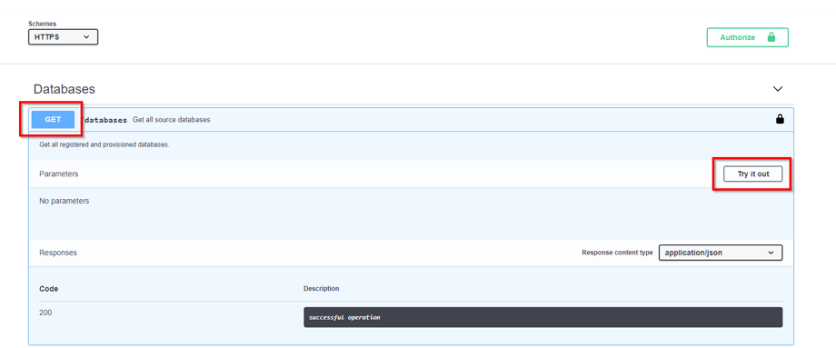

You should receive a JSON response body similar to the image below.

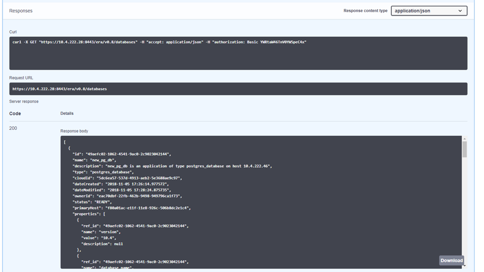

This API can be used to create powerful workflows using tools like Nutanix Calm, ServiceNow, Ansible, or others. As an example you could provision a Calm blueprint containing the web tier of an application and use a Calm eScript to invoke Era to clone an existing database and return the IP of the newly provisioned database to Calm.

Takeaways
+++++++++

关于Nutanix Era的核心内容：

- Era支持Oracle、SQL Server、PostgreSQL、MariaDB。

- Era支持一键式操作，用于注册、配置、克隆和刷新受支持的数据库。

- Era支持与公共云相同的简单性和操作效率，同时允许dba维护控制。

- Era自动化了复杂的数据库操作——使用传统技术大大减少了DBA的时间和管理数据库的成本，大大节省了企业运营成本。

- Era允许数据库管理员跨数据库引擎标准化数据库部署，并自动合并数据库最佳实践。

- Era允许dba将其环境克隆到最新的应用程序一致性事务。

- Era提供了一个REST API，支持与其他编制和自动化工具的集成。

